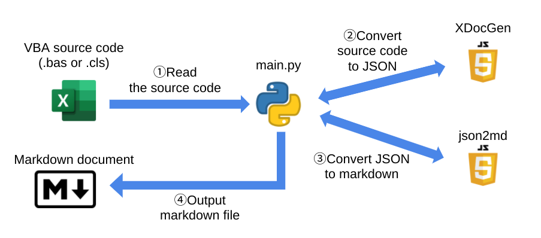

# SpecDocGenerater
Specefication document generater for VBA code

# Overview
* Python script to generate a specification documor VBA in markdown format
* 2 javascript modules are run via PyExecJS
  * PyExecJS are already end of life (https://pypi.org/project/PyExecJS/)
* Appreciated for the each modules in bellow
  * @x-vba [XDocGen](https://github.com/x-vba/xdocgen)
    * Javascript module to create a json data from VBA source code comment
  * @IonicaBizau [json2md](https://github.com/IonicaBizau/json2md)
    * Javascript module to convert the json data to markdown data

# Description
* Specification document content will be generate from the comments in VBA source code
* The document will be output by markdown format
* Python script will call 2 javascript modules
  * XDocGen
  * json2md
* Please follow the syntax in [XDocGen homepage](https://x-vba.com/xdocgen/) for the format of VBA source code comments



# How to use
## Install
### PyExecJS

```
pip install PyExecJS
```

### json2md

```
yarn install indento
yarn install json2md
```
"**Nodejs**" are also required to run xdocgen & json2md

*Developed in windows 10 environment. Please change the installation command based on your environment*

## Add comments in VBA source code
* Basically follows the syntax in [XDocGen homepage](https://x-vba.com/xdocgen/)
* "@Module" and "@Property" are only allowed in the **Module Level Tags**

## Execute python code

```
python main.py [input folder directory] [output folder directory]
```

* All ".bas" file & ".cls" file will be read in `input folder directory`
* Markdown files will be generated separately by each input file in `output folder directory`
 
## Ignore file list
* You can select the file name that not to generate the markdown file from `ignore_file_list.txt`

# Example
## example.bas (Input VBA)
```
'@Module: Example module
Public Function ExampleFunction(arg1 As Long, arg2 AS String) As String
	'@Description: This function is a sample function
	'@Param: arg1 First argument
	'@Param: arg2 Second argument
	'@Returns: Returns sample string	
	ExampleFunction = "example"
End Function

'@Property: Example property
Property Get ExampleProperty()
	'@Description: Get example property
	'@Returns: Returns sample string
    ExampleProperty = "example"
End Property
```

## doc_example.md (Output Markdown)
```
# example.bas
## Module: ExampleFunction
Example module
### **Basic infomation**

| key | value |
| --- | ----- |
| Name | ExampleFunction
Scope | Public
Static | False
Procedure | Function
Type | String
Description | This function is a sample function
Returns | Returns sample string	 |

### **Parameter**
| index | Name | Optional | Passing | ParamArray | Type | Array | Default | Description |
| ----- | ---- | -------- | ------- | ---------- | ---- | ----- | ------- | ----------- |
| 1 | arg1 | False | ByRef | False | Long | False | None | First argument
2 | arg2 | False | ByRef | False | String | False | None | Second argument |

---
## Property: ExampleProperty(Get)
Example property

### **Basic infomation**

| key | value |
| --- | ----- |
| Name | ExampleProperty(Get)
Scope | Public
Static | False
Procedure | Property
Type | Variant
Description | Get example property
Returns | Returns sample string |

---
```